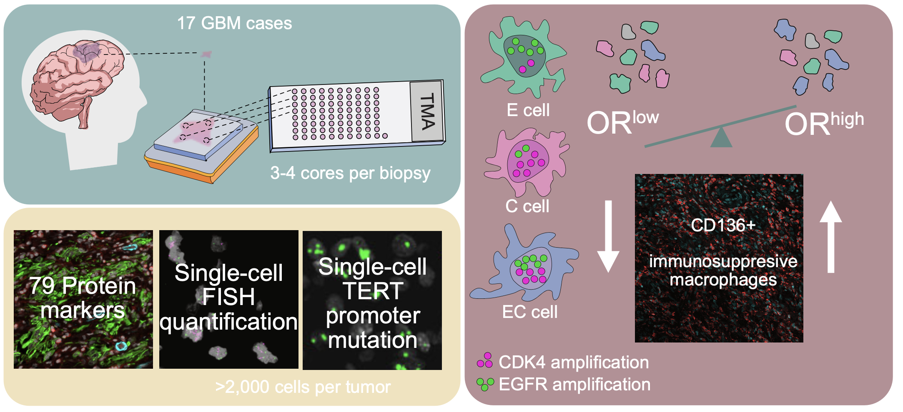

Single-cell heterogeneity of EGFR and CKD4 co-amplification is linked to immune infiltration in glioblastoma
--------

This repository contains code, data, tables and plots to support analyses and reproduce results from the paper [Single-cell heterogeneity of EGFR and CKD4 co-amplification is linked to immune infiltration in glioblastoma](https://), accepted in principle for publication as of February 2023.

Abstract
--------
Glioblastoma (GBM) is the most aggressive brain tumor with a median survival of ~15 months. Targeted approaches have not been successful in this tumor type due to the large extent of intratumor heterogeneity. Mosaic amplification of oncogenes suggests that multiple genetically distinct clones are present in each tumor. To uncover the relationships between genetically diverse subpopulations of GBM cells and their native tumor microenvironment, we employ highly multiplexed spatial protein profiling, coupled with single-cell spatial mapping of fluorescence in situ hybridization (FISH) for EGFR, CDK4, and PDGFRA. Single-cell FISH analysis of a total of 35,843 single nuclei reveals that tumors in which amplifications of EGFR and CDK4 more frequently co-occur in the same cell exhibit higher infiltration of CD163+ immunosuppressive macrophages. Our results suggest that high throughput assessment of genomic alterations at the single cell level could provide a measure for predicting the immune state of GBM.

 

Content
-------
* `/FISH_diversity/`: materials to reproduce the results related to FISH data (Figs. 2,3,4,5 in manuscript): input FISH data, Python code and relevant metadata and annotation tables. Note that the file mmc3.xlsx was too large to be uploaded to GitHub, and can be downloaded from [Zenodo](https://zenodo.org/record/7606465#.Y-KFwC-B2NE) instead. For questions related to these analyses, please reach out to Michalina Janiszewska (email: mjaniszewska@scripps.edu), the lead contact of the study.
* `/WGS/`: materials to reproduce the analyses of the Whole Genome Sequencing data introduced in this manuscript: bash and Python scripts, as well as Snakemake files. For questions related to these analyses, please reach out to [Aashna Jhaveri](https://github.com/Aashna01) or [Simona Cristea] (scristea@jimmy.harvard.edu).
* `/scRNAseq/`: materials to reproduce the single cell RNA sequncing (scRNAseq) analyses in this paper: preprocessing of two publicly available datasets. subfolder `/code/` contains the R code used, `/scRNAseq/`, `/plots/` the generated plots and `/tables/` the markers used for cell type classification. The preprocessed data used as input for these scripts needs to be downloaded frm [Zenodo](https://zenodo.org/record/7606465#.Y-KFwC-B2NE), de-compressed, and placed in the folder 'data'.

Data
-------
Whole Genome Sequencing data can be downloade from [dbGaP](https://www.ncbi.nlm.nih.gov/projects/gap/cgi-bin/study.cgi?study_id=phs003100.v1.p1)

Preprocessed RDS objects can be downloaded from [Zenodo](https://zenodo.org/record/7606465#.Y-KFwC-B2NE).

FISH data is available within this repository.